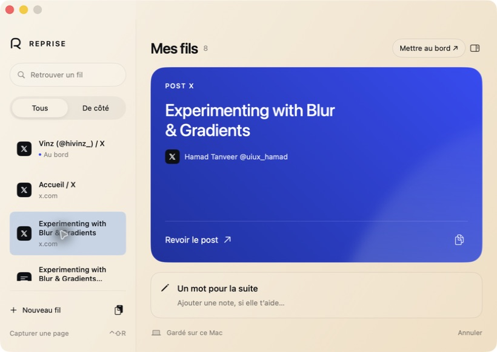
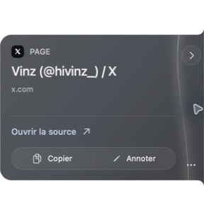

# Reprise 0.4.0 — Garder au bord

Un petit signet au bord du Mac pour garder une référence pendant qu’on s’en sert. Capture en un geste depuis le navigateur, note facultative et retour à la source. À l’intérieur, les fils mis de côté restent accessibles.

Fork natif de [Codenotch](https://github.com/vinzdg/codenotch), dont la forme, le principe du panneau non activant et le suivi du pointeur servent de base. Les sources originales sont conservées ; la cible Reprise ne compile aucun provider IA ni updater.

## En images

Captures de l’application native **Reprise 0.4.0** sur macOS.

**Mes fils** — retrouver une référence, lire son contenu et ajouter une note pour la suite.



**Au bord de l’écran** — rouvrir la source, copier ou annoter depuis la carte compacte.



## Identité

R ouvert, bleu #235CD6, bleu clair #89A7EA et blanc. Icônes app et extension disponibles dans [Brand](Reprise/Brand/README.md).

## Interface 0.4.0

La carte utilise un matériau natif fumé qui échantillonne le bureau derrière elle. Une courbure lumineuse relie les commandes à la surface. Copier et Annoter sont groupés ; Mes fils, Ranger et le choix du bord sont dans le menu « … ». Le lien de reprise remplace le gros bouton. Largeur288pt ; hauteur224pt pour un titre seul,264pt pour un extrait,196pt pendant le dépôt. L'encoche fermée reste22×76pt, la fenêtre native reste fixe.

La bibliothèque adopte le beige #F0D8B5, le bleu doux #BDD0E7, le bleu royal #324CF9 et le noir. Un titre unique, la source et l'extrait se lisent dans le panneau bleu ; une bande distincte ouvre la note personnelle. Les notes sans lien sont lisibles dans le panneau. Recherche, filtre, copie, annotation et rangement restent locaux.

Les icônes de marque app/extension conservent l’identité approuvée. L’extension reste en0.3.2 ; aucun rechargement nécessaire pour cette passe native.

Retour source : tag `reprise-before-card-0.3.2`.

## Capture navigateur

L’extension locale transmet titre, auteur, extrait sélectionné et position YouTube lorsqu’ils sont disponibles. Le raccourci proposé est **⌃⇧R**. Le pont Native Messaging confirme après sauvegarde dans l’app. Voir [le guide d’installation et les limites](Reprise/BROWSER.md).

La capture d’un post X depuis Dia est vérifiée de bout en bout, par le menu de l’extension et par **Contrôle + Maj + R**. Le pont est installé après accord utilisateur. Voir le journal de vérification.

## Utiliser

- Survoler le signet de 22 × 76 points : un volet compact se déplie, avec le titre, l’extrait et la source.
- **Reprendre** ouvre le lien ou le fichier ; une capture YouTube propose son instant de reprise. **Copier avec la source** place le texte et son attribution dans le presse-papiers. **Ranger** libère le bord et conserve le fil dans l’app.
- **Mes fils** rassemble les fils conservés : recherche dans les titres, phrases et sources, filtre De côté, édition et copie du point de reprise.
- **Mettre au bord** remplace le fil actif ; le précédent reste dans la bibliothèque.
- Le menu « … » dans la carte ouvre Mes fils. Le menu macOS propose aussi la création, le collage explicite, le choix du bord et Quitter.
- ⌘0 ouvre Mes fils ; ⌘N crée un fil dans cette fenêtre ; ⌘Entrée enregistre dans l’éditeur.

Un seul fil est actif au bord. Les autres sont conservés, sans échéance ni notification. Une étape d’annulation permet de revenir sur le dernier changement du fil actif.

## Construire et tester

Node.js pour les tests de l’extracteur ; Command Line Tools Apple, Swift 6.2.1 testé sur macOS 26. Aucun package tiers requis pour la cible Reprise.

```sh
bash Reprise/build.sh
open build/reprise/Reprise.app
bash Reprise/test.sh
```

Le build compile pour l’architecture du Mac et produit un bundle ainsi qu’un ZIP signé ad hoc. La distribution locale testée est Apple Silicon, non notarisée. Voir [le journal de vérification](Reprise/VERIFICATION.md).

## Données

`~/Library/Application Support/Reprise/thread.json` conserve le fil actif, le précédent et les fils rangés. Les archives V1 sont lues sans réinitialisation. `REPRISE_STATE_PATH` isole les essais. Le choix du bord est conservé dans les préférences de l’app.

Les fichiers restent des références à leurs chemins. Un fichier déplacé nécessite de modifier sa source. Aucun compte IA, accès au trousseau, téléchargement d’aperçu, télémétrie ou lecture automatique du presse-papiers. Le collage est explicite.

## Limites

Le suivi est limité au premier écran, à gauche ou à droite. Le ressenti au trackpad et la diversité des sources de glisser-déposer restent à éprouver. Les textes au bord sont abrégés ; Mes fils permet de lire leur intégralité. Modifier un fil l’active au bord, comme indiqué dans l’éditeur.

## Origine et licence

MIT, copyright Codenotch © 2026 Vinz conservé dans [LICENSE](LICENSE) et le bundle. `Sources/Notch/SideNotchShape.swift` et `NotchMotion.swift` sont conservés. Reprise utilise son propre ressort plus amorti pour la lecture compacte. [README Codenotch original](README.Codenotch.md).

Les workflows upstream restent limités à vinzdg/codenotch, pour ne pas publier une distribution Codenotch depuis ce fork.
